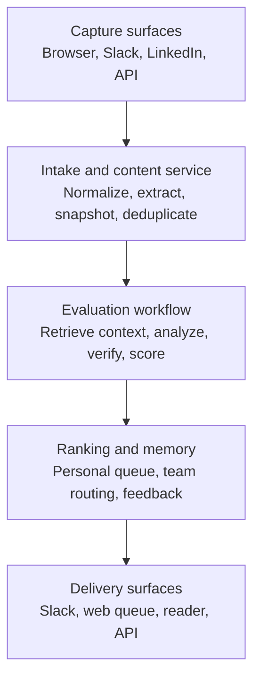
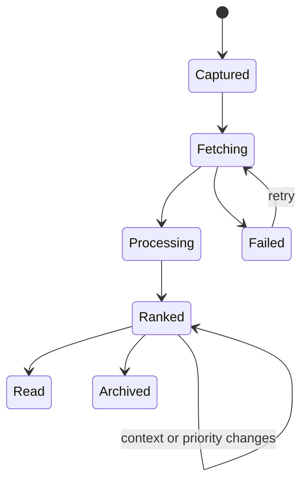

# DAM Read Later

> **Working tagline:** It reads before you do.

**Status:** Product and implementation brief, v0.1  
**Audience:** Product and engineering  
**Purpose:** Provide enough product definition, technical direction, and MVP scope for implementation to start.

## 1. Executive summary

DAM Read Later is an agentic reading filter. It captures potentially useful content wherever a person encounters it, reads and evaluates that content against the person's current context, removes low-value material, and produces a small, ordered queue of what is genuinely worth reading.

It is not primarily a bookmark manager, a summarizer, or another inbox. Traditional read-it-later products make capture easy but allow an unbounded backlog to accumulate. People rarely return, and the collection becomes a graveyard. DAM Read Later assumes that the agent should read everything first so the person does not have to.

The desired outcome is not "more saved articles." It is:

- fewer, better things competing for attention;
- confidence that low-value content can be safely ignored;
- regular deep reading of the highest-value material, ideally one strong article per day;
- a continuously improving understanding of what is valuable to each person and team;
- a shared organizational memory that does not depend on links scattered across direct messages and channels.

The summary is secondary. Its main job is to support filtering and prioritization. For the best content, the system should encourage deep reading rather than replace it with a shallow summary.

## 2. Why this should exist

### The underlying problem

Useful information arrives through too many surfaces: Slack conversations, direct messages, LinkedIn, browsers, newsletters, blogs, papers, and recommendations from colleagues. Capture is fragmented, evaluation is expensive, and the volume is too high to process manually.

Existing approaches fail in predictable ways:

1. Browser reading lists and bookmark managers store links but do not make meaningful decisions.
2. Read-it-later applications optimize collection and reading, but the queue still grows faster than the user can consume it.
3. AI summarizers reduce every item to a brief but do not determine whether the item deserves attention.
4. Generic newsletters filter for an audience, not for one person's current work and prior knowledge.
5. Team sharing happens across channels and direct messages, producing duplication and poor discoverability.
6. Personal automation experiments often die because they create another destination the user must remember to visit.

### Product thesis

The scarce resource is not access to content. It is qualified human attention.

The product should therefore optimize for **attention allocation**, not collection. The agent reads broadly; the person reads selectively and deeply.

## 3. Product definition

### One-sentence description

DAM Read Later is a context-aware agent that captures, evaluates, filters, and ranks reading material before it reaches the user.

### Core promise

When DAM Read Later recommends that you read something, it should be because the material is relevant to what you are doing, contains information you probably do not already know, and is supported by enough substance to justify your time.

### Product principles

1. **Filtering before summarization.** The first question is whether the content deserves attention, not how to summarize it.
2. **Deep reading over shallow consumption.** Summaries help eliminate weak content. Strong content should still be read in full.
3. **Capture without interruption.** Saving something should take one click, one shortcut, or one reaction.
4. **Context determines value.** A good article can still be irrelevant, redundant, or mistimed for a particular person.
5. **An intentionally finite queue.** The system should actively remove, defer, and expire items instead of building an infinite backlog.
6. **Explain every recommendation.** Rankings must show why something is relevant, novel, credible, or urgent.
7. **Human overrides are authoritative.** "Must read" bypasses filtering. Users can correct rankings without fighting the system.
8. **Learn from explicit outcomes.** Useful, not useful, read, skipped, and "summary was enough" are better signals than passive clicks alone.
9. **Personal and team value are related but distinct.** Something may be valuable to the team without being valuable to every individual.
10. **Own the intelligence.** External products may provide capture or reading interfaces, but DAM Read Later owns context, evaluation, ranking, and feedback data.

### Non-goals

The initial product is not:

- a general bookmark manager;
- an RSS reader or infinite personalized news feed;
- a replacement for reading high-value source material;
- a general-purpose knowledge base;
- a generic "chat with your bookmarks" interface;
- a full publishing, annotation, or social-network product;
- an autonomous crawler of the entire web.

## 4. Primary users and jobs

### Individual knowledge worker

The user encounters more material than they can evaluate. They want to capture it immediately and later receive a very short, trustworthy list of what deserves deep attention.

Core job: **"Read on my behalf first, then tell me what is worth my limited reading time and why."**

### Team member sharing expertise

The user finds something that may be important for colleagues but does not know who has already seen it, who would benefit, or where it should live.

Core job: **"Route this to the right people and retain the useful knowledge without creating more channel noise."**

### Team or domain lead

The user wants the team to remain current on important developments without everyone independently scanning the same sources.

Core job: **"Build a shared, curated information layer and surface only the material that changes our understanding or decisions."**

## 5. Core user experience

### 5.1 Capture

Capture should work from the places where information already appears:

- **Arc and Chrome:** extension icon, configurable keyboard shortcut, and browser context menu.
- **Slack:** message action or a dedicated reaction such as `:read-later:`. The existing Slack history agent can provide a prototype intake, but production capture should use explicit events where possible.
- **LinkedIn:** the browser extension captures the post or article URL and, when permitted, the rendered text visible in the browser.
- **Mobile:** operating-system share sheet in a later milestone.
- **API:** a simple endpoint for other agents, internal tools, newsletters, and future integrations.

Default capture is one action with no required categorization. If text is selected, the selection is captured as a strong clue about why the item matters.

Two optional capture modes are useful:

- **Normal:** evaluate and filter this item.
- **Must read:** keep and prioritize it regardless of the model's initial value judgment. A note such as "Kate recommended this" should be retained as context.

### 5.2 Processing

After capture, the system should:

1. Resolve the canonical URL and detect duplicates.
2. Acquire readable content and retain a safe snapshot.
3. Identify the content type, author, source, publication time, and estimated reading time.
4. Retrieve the most relevant personal and team context.
5. Extract the main claims and supporting evidence.
6. Estimate relevance, novelty, credibility, insight density, urgency, and reading value.
7. Detect redundancy, hype, promotional content, weakly supported claims, and FOMO-driven urgency.
8. Produce a recommendation with evidence and confidence.
9. Insert the item into the ranked queue, summarize it for inspection, or archive it.

### 5.3 Daily reading queue

The default experience should not be an inbox. It should be a deliberately small, ordered plan:

1. **Read today:** the single strongest item for the user's current context.
2. **Read next:** a small number of additional high-value items.
3. **Skim selected sections:** valuable, but not enough to justify the entire reading cost.
4. **Summary is enough:** useful information has been extracted; full reading is unlikely to add much.
5. **Filtered out:** low relevance, redundant, vague, promotional, or pure FOMO.

The system should be comfortable returning no recommended article on a low-signal day.

### 5.4 Recommendation card

Each retained item should show:

- title, source, author, publication date, and reading time;
- recommendation and priority;
- why it matters now;
- what is genuinely new relative to the user's context;
- the strongest concrete insight, evidence, or example;
- what is weak, repetitive, uncertain, or promotional;
- a short TL;DR;
- confidence in the assessment;
- the original URL and captured version;
- actions: Read, Must read, Later, Summary was enough, Useful, Not useful, and Archive.

### 5.5 Reading experience

For MVP, the original page can remain the primary reading surface. A clean internal reader is valuable later for:

- stable article snapshots;
- highlights and annotations;
- showing why particular passages influenced the recommendation;
- connecting passages visually to projects, people, prior articles, and team knowledge;
- integration with a future visual knowledge environment, similar to the former Brainio direction.

## 6. What "valuable" means

The filtering model needs an explicit rubric. It should not learn only from engagement because click behavior rewards novelty and outrage as easily as substance.

### Positive signals

| Dimension | Question the system should answer |
| --- | --- |
| Contextual relevance | Does this connect to an active project, responsibility, decision, relationship, or learning goal? |
| Novelty | Does it contain claims or mechanisms not already represented in the user's knowledge and recent reading? |
| Hard-won insight | Does it report firsthand experience, failures, trade-offs, implementation details, real constraints, or lessons that took meaningful work to obtain? |
| Evidence quality | Are claims supported by primary evidence, data, reproducible examples, source links, or a credible chain of reasoning? |
| Source proximity | Is the author close to the work, event, research, or decision being described? |
| Actionability | Could this change a decision, design, experiment, conversation, or behavior? |
| Explanatory depth | Does it explain mechanisms and causality rather than merely asserting conclusions? |
| Timeliness | Is the information time-sensitive for the user, or newly relevant because of current work? |
| Team value | Would this fill a known gap, resolve a discussion, or help specific colleagues? |
| Reading efficiency | Is the expected value worth the time required to read it? |
| Slop risk | Is the content derivative, padded, generic, or produced without enough original reasoning or evidence? |

### Negative signals

- Repeats information the user already knows without adding evidence or a new angle.
- Uses urgency, popularity, or controversy as a substitute for substance.
- Reports news that will reach the user through normal professional channels anyway.
- Makes broad claims without mechanisms, examples, limitations, or primary sources.
- Is primarily promotional, affiliate-driven, or optimized for engagement.
- Summarizes other summaries while obscuring the original source.
- Contains a small useful point padded into a long article.
- Is topically related but not relevant to current work.

"Slop" should describe observable information quality, not guessed authorship. The system should detect derivative claims, repetition, padding, unsupported certainty, and low insight density. It should not claim that it can reliably determine whether a human or AI wrote the text, and AI-assisted authorship should not be a penalty by itself.

### Distinguishing important content types

**Hard-won insight:** firsthand implementation experience, specific failures, real numbers, trade-offs, constraints, unexpected results, or falsifiable mechanisms.

**Proven knowledge:** established findings supported by credible evidence. It may not be fresh, but it can be highly valuable when it closes a context gap.

**News:** a new event or announcement. Its value depends on relevance and expiration, not merely recency.

**Hype or FOMO:** urgency or popularity with little durable information, weak evidence, or no clear consequence for the user.

**Useful synthesis:** mostly known material organized into a model that improves understanding or decision-making.

## 7. Ranking approach

### MVP scoring model

Use interpretable dimensions scored from 0 to 5. Start with explicit weights and calibrate them using human judgments.

```text
base_value =
    0.25 * contextual_relevance
  + 0.20 * novelty
  + 0.20 * hard_won_insight
  + 0.15 * evidence_quality
  + 0.10 * actionability
  + 0.10 * source_proximity

penalty =
    redundancy
  + hype_or_fomo
  + promotionality
  + avoidable_reading_cost

priority = adjusted(base_value - penalty, urgency, must_read, team_signal)
```

The exact formula should remain configurable. The scores exist for explanation and diagnosis, not as a claim that human value can be perfectly reduced to arithmetic.

### Ranking should become comparative

Absolute scoring is sufficient for the first vertical slice. The mature system should also compare candidates pairwise: "Given this person's context and 20 minutes, which of these two items is more valuable to read today?" This better matches the actual decision and reduces score inflation.

### Freshness is not universal value

Freshness should determine scheduling and expiration:

- time-sensitive, relevant news may need to be read today;
- a strong evergreen article can wait without losing value;
- irrelevant news should not outrank durable insight simply because it is new.

### Overrides and trusted recommendations

`must_read` bypasses filtering but does not suppress analysis. The system still explains the item and places it appropriately.

A recommendation from a trusted colleague is a meaningful signal, not an automatic guarantee of content quality. The model should retain who recommended the item and why, and learn source-specific trust over time.

## 8. Context model

The quality of DAM Read Later depends on context more than on summarization quality.

### Context layers

1. **Stable personal context:** role, responsibilities, domains, long-term interests, preferred depth, known expertise, and topics to avoid.
2. **Active context:** current projects, decisions, upcoming meetings, open questions, experiments, and writing in progress.
3. **Knowledge context:** previously read items, highlights, accepted insights, and concepts the user already understands.
4. **Team context:** projects, discussions, shared documents, expertise, responsibilities, and unresolved questions.
5. **Trust context:** authors, publishers, colleagues, and sources with learned or explicit credibility.
6. **Attention context:** available reading time, desired cadence, backlog size, and preferred content depth.

### Context sources

Potential sources include explicit profile text, Slack, GitHub, meeting transcripts, project documents, previous DAM Read Later decisions, and user feedback. Each source must have clear permissions and tenant boundaries.

For MVP, start with an explicit editable context profile plus retrieval from a limited set of approved sources. Do not make the first version dependent on a perfect personal knowledge graph.

### Context retrieval

Do not send the user's entire digital history into every evaluation. Retrieve a small evidence set relevant to the captured item:

- related active projects and questions;
- similar previously processed articles;
- recent team discussions mentioning the topic;
- known expertise and prior conclusions;
- trusted or distrusted sources.

Store which context fragments influenced the decision so recommendations remain inspectable.

## 9. Team intelligence

Team mode should not create one universal feed. It should use shared information to improve personal routing.

### Team capabilities

- Deduplicate links shared across direct messages and channels.
- Recognize that several people are discussing the same topic.
- Identify who would benefit from a particular item.
- Explain why an article is relevant to a project or ongoing discussion.
- Maintain a curated library of strong authors, blogs, papers, and sources.
- Optionally crawl or monitor trusted sources and recommend new material.
- Preserve high-value insights and highlights beyond the lifetime of a Slack conversation.
- Show what the team learned, not just what the team saved.

### Sharing model

An item has separate personal and team assessments. A user may mark an article valuable for the team without adding it to every person's queue. The routing agent should target specific people or projects and avoid broad notifications by default.

## 10. Proposed system architecture



### Components

#### Capture clients

- Manifest V3 browser extension for Chrome and Arc.
- Slack app actions and event consumer.
- Public/internal intake API.
- Later: mobile share extension, email forwarding, RSS, and connectors to existing reading tools.

#### Intake API

Responsibilities:

- authenticate user and workspace;
- accept URL, rendered content, selection, comment, source surface, and override flags;
- return an immediate capture confirmation;
- produce an idempotent processing event;
- avoid waiting for model processing in the capture interaction.

Suggested endpoints:

```text
POST /v1/items
GET  /v1/items/{id}
GET  /v1/queue
POST /v1/items/{id}/feedback
POST /v1/items/{id}/must-read
POST /v1/items/{id}/archive
```

#### Content service

Responsibilities:

- canonicalize URLs and remove tracking parameters;
- detect exact and semantic duplicates;
- prefer rendered content supplied by the browser when pages require authentication or JavaScript;
- otherwise fetch and extract server-side;
- convert content to normalized Markdown;
- store the original capture, safe snapshot, content hash, and extraction provenance;
- extract metadata and estimate reading time;
- retry temporary extraction failures.

The browser extension should use a proven readability extractor rather than sending unrestricted page scripts or raw browser state. LinkedIn and authenticated pages require special care because server-side fetching will often fail.

#### Evaluation workflow

For MVP, use one controlled workflow with structured model calls rather than a complex multi-agent system. Suggested stages:

1. Metadata and content-type classification.
2. Claim, evidence, and insight extraction.
3. Personal and team context retrieval.
4. Relevance, novelty, quality, and risk assessment.
5. Recommendation and explanation generation.
6. Queue ranking against existing candidates.

Each stage should have a versioned structured output. Deterministic code should handle URL normalization, deduplication, state transitions, retries, permissions, and ranking arithmetic.

#### Storage

Use relational storage for item state, analysis, scores, feedback, users, workspaces, and provenance. Use object storage for content snapshots. Add vector retrieval for semantic deduplication and context lookup, but retain ordinary full-text search and stable identifiers.

#### Delivery

Slack is the strongest initial delivery surface because the team already works there and can provide feedback with little friction. A small web queue becomes useful when exact ordering, reading state, search, and deeper inspection outgrow Slack cards.

## 11. Core data model

### Captured item

```json
{
  "id": "item_id",
  "workspace_id": "workspace_id",
  "user_id": "user_id",
  "source_surface": "browser|slack|linkedin|api",
  "source_message_id": "optional",
  "url": "original URL",
  "canonical_url": "normalized URL",
  "title": "captured title",
  "selected_text": "optional",
  "user_note": "optional",
  "recommended_by": "optional identity",
  "must_read": false,
  "captured_at": "timestamp",
  "content_snapshot_id": "snapshot_id",
  "status": "captured|fetching|processing|ranked|read|archived|failed"
}
```

### Analysis result

```json
{
  "item_id": "item_id",
  "analysis_version": "rubric-and-model version",
  "content_type": "hard_won|proven|news|synthesis|opinion|promotional",
  "topics": ["topic"],
  "tldr": "short summary",
  "main_claims": [],
  "new_insights": [],
  "supporting_evidence": [],
  "weaknesses": [],
  "context_reasons": [],
  "scores": {
    "relevance": 0,
    "novelty": 0,
    "hard_won": 0,
    "evidence": 0,
    "actionability": 0,
    "urgency": 0,
    "redundancy": 0,
    "hype_fomo": 0,
    "slop_risk": 0
  },
  "recommendation": "read_today|read_next|skim|summary_enough|filter_out",
  "confidence": 0.0,
  "estimated_reading_minutes": 0,
  "expires_at": "optional timestamp"
}
```

### Feedback event

```json
{
  "item_id": "item_id",
  "user_id": "user_id",
  "action": "read|useful|not_useful|misranked|later|summary_enough|archive",
  "reason": "optional",
  "created_at": "timestamp"
}
```

Keep model-produced analysis append-only by version. Do not overwrite the evidence needed to understand why a past recommendation was made.

## 12. State model



An archived item remains searchable and reversible. Filtering must not silently destroy captured material.

## 13. Safety, privacy, and trust

### Treat content as untrusted

Articles and posts can contain prompt injection. The evaluation workflow must treat captured content as data, not instructions.

- Do not give the content-analysis model unnecessary tools.
- Separate system instructions, user context, and captured content structurally.
- Never allow article text to change permissions, routing, or external actions.
- Sanitize active content and scripts before storage or rendering.
- Preserve citations to captured passages for important judgments.

### Permissions and privacy

- Apply workspace and user-level access control to every item and context fragment.
- Do not use private Slack or document context without explicit authorization.
- Keep personal ranking data private by default.
- Separate shared team insights from personal notes and reading behavior.
- Support deletion of raw content, analysis, embeddings, and derived context.

### Explainability

Every strong recommendation or rejection should be traceable to:

- passages in the captured content;
- relevant personal or team context;
- rubric dimensions;
- the model, prompt, and rubric version used.

## 14. Learning loop

The system should initially learn from explicit feedback and observed outcomes:

- Was the item actually read?
- Did the user mark it useful after reading?
- Was the summary sufficient?
- Did the user override a rejection?
- Was the recommendation mistimed rather than wrong?
- Did the item influence a document, decision, issue, or conversation?

Clicks and dwell time are weak supporting signals, not ground truth. A user may open an article and find it worthless, or fail to open an excellent article because they were busy.

Periodically derive proposed preference updates such as "prefer firsthand infrastructure postmortems over product announcements." Let the user inspect or correct important learned preferences.

## 15. MVP scope

### Required vertical slice

1. Chrome/Arc extension with one-click capture and optional selected text.
2. `Normal` and `Must read` capture modes.
3. Slack message capture through one explicit action.
4. Content extraction, normalized Markdown snapshot, and deduplication.
5. Editable personal context profile.
6. Structured analysis using the initial rubric.
7. Ranked personal queue with five recommendations: Read today, Read next, Skim, Summary enough, and Filtered out.
8. Slack delivery of the top recommendation and an on-demand queue view.
9. Explicit feedback actions and stored feedback events.
10. Transparent evidence and confidence for recommendations.

### Deliberately excluded from MVP

- Native mobile applications.
- Full internal reading and annotation experience.
- Continuous crawling of followed authors and sources.
- Broad automatic ingestion of all Slack links.
- Sophisticated organizational knowledge graph.
- Automatic preference changes without review.
- Complex multi-agent orchestration.
- Public social sharing or discovery feed.

## 16. Suggested implementation sequence

### Milestone 0: Evaluation spike

Before building extensive UI, assemble a representative test set of approximately 100 items:

- hard-won technical posts;
- credible research and primary sources;
- announcements and ordinary news;
- generic AI commentary;
- promotional and FOMO-heavy posts;
- duplicates and near-duplicates;
- items relevant and irrelevant to known active projects.

Have two or three intended users label pairs and answer: "Which would be more valuable for me to read today, and why?" Use this set to establish whether the rubric can produce useful separation.

### Milestone 1: Capture-to-recommendation vertical slice

- Browser capture.
- URL/content extraction.
- Static editable context profile.
- One evaluation workflow.
- Slack recommendation card.
- Manual feedback.

Success condition: a user can capture an article in one action and receive a credible, evidence-backed recommendation without visiting another application.

### Milestone 2: Queue and discipline

- Finite daily queue.
- One-read-per-day mode.
- Scheduling, expiration, and backlog pruning.
- Pairwise ranking against existing candidates.
- Weekly feedback review and preference proposals.

Success condition: the queue remains small and the user regularly reads at least one high-value item rather than accumulating links.

### Milestone 3: Team intelligence

- Slack sharing identity and discussion context.
- Cross-user duplicate detection.
- Personal versus team value assessments.
- Targeted routing to relevant colleagues.
- Curated sources and optional monitoring.

Success condition: useful content reaches the right people with less broad channel noise, and repeated sharing becomes reusable team knowledge.

### Milestone 4: Rich reading and knowledge connections

- Internal reader and highlights.
- Evidence-linked recommendation explanations.
- Visual connections to projects, discussions, prior insights, and people.
- Brainio-like exploration of the resulting knowledge graph.

## 17. Validation and success metrics

### Ranking quality

- Precision among the top one and top three recommendations.
- Pairwise agreement with user judgments.
- Percentage of "Read today" items later marked useful.
- False-rejection rate: filtered items later restored or marked valuable.
- Redundancy detection accuracy.

### Behavior and discipline

- High-value items read per week.
- Percentage of recommended items completed.
- Median active queue size and item age.
- Percentage resolved as Summary enough or Filtered out.
- Number of days with one intentional deep read.

### Team value

- Duplicate shares avoided.
- Targeted recommendations accepted.
- Insights reused in decisions, documents, or issues.
- Reduction in links scattered across direct messages and unrelated channels.

Do not use the number of captured items, summaries generated, or total engagement as primary success metrics. Those can increase while the product makes attention management worse.

## 18. Acceptance criteria for the first release

The first release is ready for a small internal pilot when:

- Capture takes one action from Arc/Chrome and Slack.
- The capture interaction responds immediately and processing continues asynchronously.
- Duplicate captures do not produce duplicate queue items.
- The system can process ordinary public articles and handle extraction failures visibly.
- Every recommendation includes evidence, relevant context, and confidence.
- Must-read items cannot be automatically filtered out.
- Users can view and restore filtered items.
- Users can correct recommendations with one action.
- Prompt injection tests cannot cause captured content to invoke tools or alter system behavior.
- Personal context and reading behavior are not exposed to the team by default.
- The queue is ordered and finite rather than an unbounded inbox.

## 19. Build versus integrate

### Recommended long-term position

Build and own:

- capture event and content snapshot format;
- personal and team context;
- evaluation rubric and structured analysis;
- ranking and learning loop;
- recommendation UI and feedback;
- provenance and historical model outputs.

Support external reading and bookmarking products as optional connectors.

### Raindrop as a prototype adapter

Raindrop can accelerate an early validation because it already provides browser/mobile capture, article extraction, tags, highlights, collections, semantic search, a REST API, and a write-capable MCP server. An agent can fetch full bookmark content and update bookmarks, notes, tags, and collections.

It should not be the only system of record because:

- it has no first-class schema for the structured scoring and provenance above;
- its native AI is interactive rather than a background personalized ranking loop;
- public-page archiving and indexing are asynchronous and do not cover authenticated content reliably;
- archived copies are a subscription-dependent asset;
- exact event-driven processing may require polling an inbox collection.

If used, mirror normalized content and analysis into DAM Read Later's own storage and treat Raindrop as an input/output adapter.

### Readwise Reader as a connector

Readwise offers excellent rendered-page capture, reading, highlighting, API/CLI access, and Markdown export. It can be useful for users who already read there. However, its product center is the human reading experience. DAM Read Later should integrate with it rather than inherit its workflow or data model.

### Final-product capture

The likely final capture surface is a small owned browser extension. It can send selected text and sanitized readable content from authenticated or dynamically rendered pages, minimize third-party dependency, and keep the core interaction consistent across Arc and Chrome.

## 20. Open product decisions

The implementation can begin without resolving every item, but these decisions should be made during the first two milestones:

1. Is Slack the only initial queue surface, or is a minimal web queue required immediately?
2. Which personal and team context sources are approved for the pilot?
3. Should one-read-per-day be the default cadence or an optional mode?
4. How long should weak or stale items remain recoverable before archival?
5. Which actions constitute strong preference-learning signals?
6. Should the initial team pilot ingest only explicitly marked Slack messages or also discover links automatically?
7. Should Raindrop be used for the validation prototype, or should the owned extension be built immediately?
8. What is the privacy boundary between personal analysis and team knowledge?

## 21. Recommended initial decisions

To avoid ambiguity for the first implementation, use these defaults:

- **Name:** DAM Read Later (short form `read-later` in code).
- **Primary delivery surface:** Slack.
- **Primary capture:** owned Chrome/Arc extension plus explicit Slack action.
- **Processing model:** one versioned workflow with structured stages, not multiple autonomous agents.
- **Queue policy:** one Read today item, up to four Read next items, and automatic pruning of the rest.
- **Context:** explicit personal profile plus approved retrieval from active project and Slack context.
- **Summary policy:** TL;DR is always available but secondary to the recommendation and evidence.
- **Storage:** own normalized content, analysis, provenance, and feedback.
- **External products:** optional adapters only.
- **Pilot:** a small internal group with different roles and a labeled evaluation set created before broad rollout.

## 22. Naming

### Name: DAM Read Later

The name takes the category word people already use for the gesture — *read later* — and places the product inside the DAM family, where `DAM` is the family prefix rather than part of the product's own name. In code, docs, and repo naming, the short form `read-later` is used on its own.

Naming the category is a deliberate choice. Read-it-later products are the reference point users arrive with, so the name costs nothing to explain. The differentiation is carried by the behavior, not the label:

> **Everything read-later, except the queue stays short — the agent reads first and only what survives reaches you.**

Because the name is descriptive rather than a coined brand, trademark exposure is low and the family prefix does the distinguishing work. If the product is later positioned as a standalone brand outside the DAM family, the name should be revisited.

### Other directions considered

- **DAM Later:** shorter and verbable ("send it to DAM Later"), but reads as a coined name and is less legible in a product menu.
- **Slate / Docket:** express the finite, daily, ordered queue better than any read-later phrasing, but need a sentence of explanation.
- **Shelf:** the finite-capacity metaphor argues the positioning for free, but it does not signal reading.
- **First Reader:** the original working name; describes the agent's role well but says nothing about the queue the user actually receives.

## 23. Reference capabilities

- [Raindrop MCP server](https://help.raindrop.io/integrations/mcp)
- [Raindrop browser extension](https://help.raindrop.io/install-extension)
- [Raindrop web archive](https://help.raindrop.io/web-archive)
- [Raindrop export and backup](https://help.raindrop.io/export)
- [Readwise Reader API](https://readwise.io/reader_api)
- [Readwise Reader CLI and agent commands](https://readwise.io/cli)
- [Readwise Reader capture](https://docs.readwise.io/reader/docs/faqs/adding-new-content)
